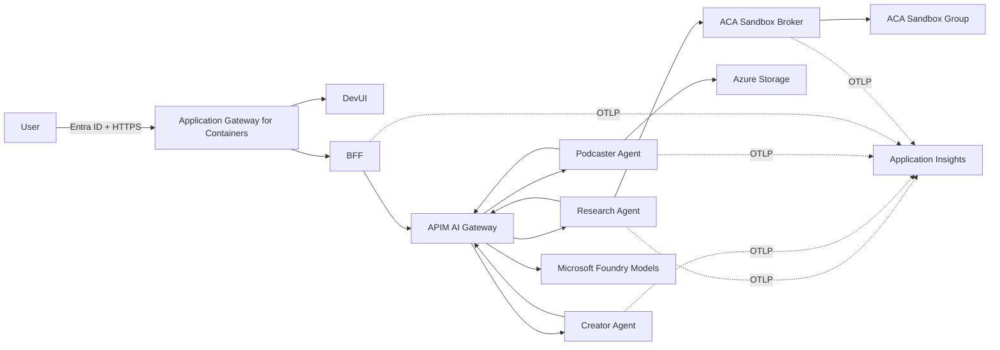

# Option 2: Agentic Content Factory on AKS

Option 2 is the active architecture direction for this repository. It runs three existing, polyglot A2A agents on Azure Kubernetes Service, keeps Azure Container Apps Sandboxes as the isolated research execution service, governs AI traffic through Azure API Management, registers agents in Microsoft Foundry, and exposes DevUI through Application Gateway for Containers.

Phase 1 establishes and validates the AKS baseline. Phase 2 may add the [Agent Reference Stack for Kubernetes (KARS)](https://github.com/Azure/kars) after the baseline passes its acceptance gates.

> Implementation status: the AKS IaC, Helm packaging, BFF, sandbox-broker integration, and runbooks are under active implementation. The original ACA template remains available in `infra/main.bicep` until the AKS deployment is validated in Azure.

## Solution flow



The existing agent responsibilities and A2A payloads remain unchanged:

1. **Research agent** — Python and LangGraph; gathers and ranks sources and optionally performs isolated retrieval through ACA Sandboxes.
2. **Content creator agent** — .NET and Microsoft Agent Framework; creates the blog and social content.
3. **Podcaster agent** — Python and GitHub Copilot SDK; creates the script and audio.

## Documentation

Read these documents in order:

1. [Architecture](docs/01-architecture.md)
2. [Components](docs/02-components.md)
3. [Implementation](docs/03-implementation.md)
4. [Installation and deployment](docs/04-installation.md)
5. [Validation and operations](docs/05-validation-and-operations.md)
6. [Phase 2: KARS considerations](docs/06-kars-phase2.md)

Existing agent-level and local-development material remains under [Lab/docs](Lab/docs/).

## Repository layout

```text
Option2/
  infra/
    main.bicep                    # Original ACA deployment
    aks/                          # Phase 1 AKS infrastructure
  deploy/helm/content-factory/    # Kubernetes workload packaging
  Lab/
    src/
      agent-research/
      agent-creator/
      agent-podcaster/
      dev-ui/
      bff/
      sandbox-broker/
  docs/                           # Ordered platform documentation
```

## Quick start

### Local application development

```powershell
Set-Location .\Option2\Lab
Copy-Item .env.example .env
docker compose up --build
```

Open `http://localhost:8080`.

### Validate deployment assets

```powershell
az bicep build --file .\Option2\infra\aks\main.bicep
helm lint .\Option2\deploy\helm\content-factory `
  -f .\Option2\deploy\helm\content-factory\values.example.yaml
```

### Deploy to Azure

Follow [Installation and deployment](docs/04-installation.md). Do not run the templates without first checking feature availability, quota, APIM tier/networking, DNS, certificates, and preview-feature acceptance.

## Security boundary

- Agent Services are private `ClusterIP` Services.
- The browser never receives A2A, model, Storage, or ACA Sandbox credentials.
- The BFF owns browser-facing API calls.
- APIM is the governed A2A and model gateway.
- The sandbox broker alone receives ACA Sandbox permissions.
- Workload identity is used for Azure resource access where supported.
- Default-deny NetworkPolicies are the baseline.

## Phase 2 boundary

KARS is not installed in Phase 1. Phase 1 prepares compatible networking, workload identity, node pools, security controls, and telemetry. KARS adoption requires a separate interoperability and security gate; see [Phase 2: KARS considerations](docs/06-kars-phase2.md).
