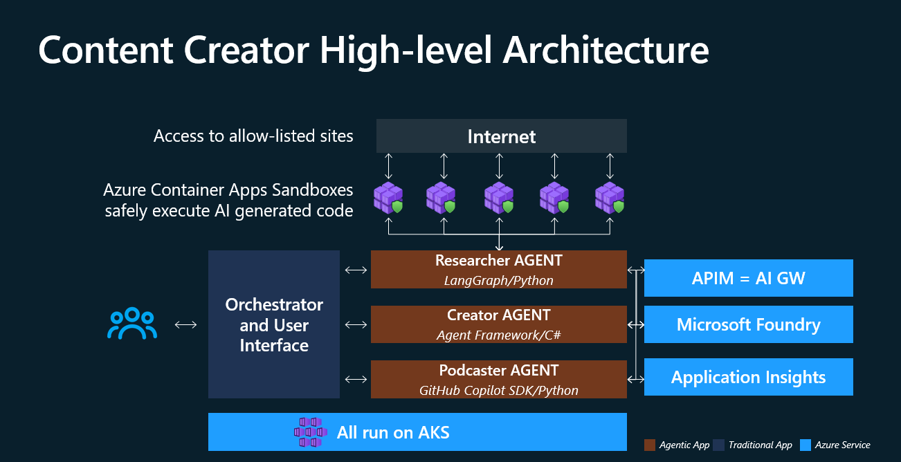
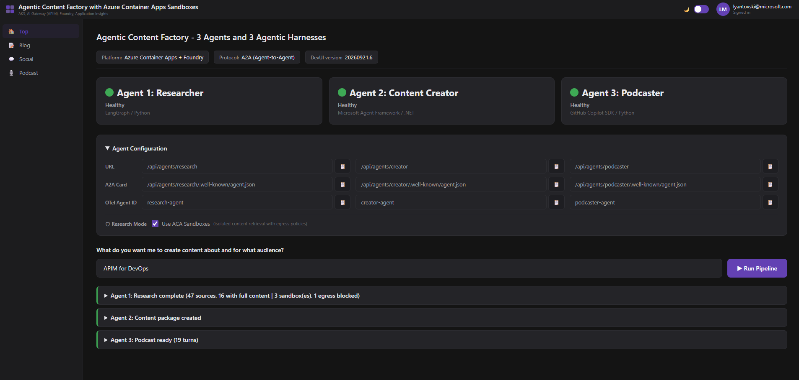
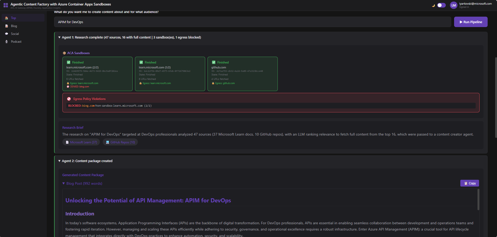
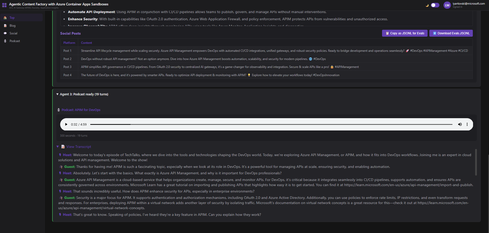

# Agentic Content Factory Lab with Azure Container Apps Sandboxes

> A hands-on reference implementation for running governed A2A agents on Azure
> Kubernetes Service while using Azure Container Apps Sandboxes for isolated,
> policy-controlled web execution.
>
> **Inspiration:** This repository was inspired by
> [jkalis-MS/azure-container-apps-multi-agent-workflow](https://github.com/jkalis-MS/azure-container-apps-multi-agent-workflow),
> created by [Jan Kalis](https://github.com/jkalis-MS). This lab evolves that
> starting point into an AKS-hosted, APIM-governed architecture with A2A agents,
> Foundry registration, private application boundaries, and ACA Sandbox-based
> retrieval.

This lab turns a topic into a complete content package: a research agent gathers
and synthesizes trusted sources, a creator agent produces written and social
content, and a podcaster agent generates and persists playable audio. The
browser orchestrates the workflow through an authenticated backend-for-frontend;
the agents do not call each other directly.

The implementation focuses on the engineering concerns that sit around the
agents as much as the agents themselves: Microsoft Entra ID authentication,
Application Gateway for Containers ingress, APIM AI Gateway governance,
Microsoft Foundry model access and custom-agent registration, private AKS
origins, workload identity, private Blob Storage, default-deny networking, and
end-to-end observability.

## Solution at a glance



The user-facing orchestrator coordinates three framework-diverse agents on AKS.
APIM governs agent and model traffic, Microsoft Foundry supplies models and
agent registration, Application Insights captures telemetry, and ACA Sandboxes
isolate the research retrieval tool. The sandboxes do not host the three
long-running agents.

## Three agents, three agent frameworks

The lab intentionally avoids treating every agent as the same application in a
different container. Each agent uses a distinct framework and runtime pairing
suited to its role, while A2A provides the common interoperability contract.
The implementation spans Python and C#/.NET:

| Agent | Framework or harness | Language and runtime | Responsibility |
|---|---|---|---|
| Researcher | LangGraph | Python and FastAPI | Searches, ranks, retrieves through ACA Sandboxes, and synthesizes a research brief |
| Content Creator | Microsoft Agent Framework | C# and .NET 10 | Converts the brief into a long-form blog post and social content package |
| Podcaster | GitHub Copilot SDK | Python and FastAPI | Generates a multi-speaker script, synthesizes audio, and persists the podcast |


DevUI is the user-facing orchestrator. Its browser JavaScript runs the research
step first, then sends the resulting brief to the creator and podcaster in
parallel through the authenticated BFF and APIM. The agents remain independently
deployable and do not call each other directly.

## See the DevUI in action

[](docs/media/devui-demo.mp4)

**[▶ Watch the full DevUI screen recording](docs/media/devui-demo.mp4)** to see
the authenticated interface run the three-agent workflow, expose live agent
health, track ACA Sandbox execution, and present the generated research,
written content, social posts, and podcast.

### Workflow results

<table>
  <tr>
    <td width="50%">
      
    </td>
    <td width="50%">
      
    </td>
  </tr>
  <tr>
    <td>
      <strong>Inspectable research and content generation.</strong><br>
      Real sandbox lifecycle cards, egress evidence, the synthesized research
      brief, and the generated content package remain visible in one workflow.
    </td>
    <td>
      <strong>Usable multimodal output.</strong><br>
      The same research brief produces social posts plus a browser-playable
      podcast with its full host-and-guest transcript.
    </td>
  </tr>
</table>

## What this lab demonstrates

| Area | Implementation |
|---|---|
| Agent runtime | Three independently deployable agents on AKS |
| Agent interoperability | A2A cards, governed invocation, task polling, and artifact exchange |
| User experience | Static DevUI with browser-side workflow orchestration |
| Identity boundary | Microsoft Entra ID, OAuth2 Proxy, and a trusted BFF |
| Application ingress | Application Gateway for Containers |
| AI governance | APIM APIs for A2A traffic and the `/openai` model gateway |
| AI platform | Microsoft Foundry models and custom-agent registration |
| Isolated execution | ACA Sandbox Group with per-task default-deny egress |
| Data persistence | Private Blob Storage accessed with Workload Identity |
| Network protection | Internal AKS agent endpoints reachable only from the APIM subnet, reinforced by Cilium policy |
| Observability | OpenTelemetry, Application Insights, Log Analytics, and APIM diagnostics |

Here, **internal AKS agent endpoints** means that each agent has a Kubernetes
`LoadBalancer` Service with a private VNet IP, not a public Internet address.
These stable private IPs are APIM backends. `loadBalancerSourceRanges` permits
connections only from the APIM subnet (`10.40.18.0/24`), and Cilium enforces
the same restriction inside AKS. As a result, DevUI and the BFF cannot bypass
APIM to invoke an agent directly.

## How the deployed system works


The detailed topology above is authoritative for network routing and security
boundaries. The runtime flow is deliberately layered:

1. A user authenticates with Microsoft Entra ID through Application Gateway for
   Containers and OAuth2 Proxy.
2. DevUI JavaScript calls same-origin protected APIs through the BFF.
3. The BFF sends A2A requests to APIM rather than exposing reusable downstream
   credentials in the browser.
4. APIM reaches three source-restricted private AKS origins: research, creator,
   and podcaster.
5. The agents use the APIM `/openai` gateway for Foundry model and TTS access.
6. Research delegates isolated retrieval to the Sandbox Broker, which creates
   policy-controlled ACA Sandboxes.
7. Podcaster persists audio through a private Blob endpoint, while workloads
   and APIM export correlated telemetry to Application Insights.

Editable Excalidraw, Draw.io, Mermaid, SVG, and PNG architecture assets are
available under [`docs/diagrams/`](docs/diagrams/README.md).

## Project status and deployment boundary

**Phase 1 - working baseline.** The AKS, APIM, Foundry, ACA Sandbox, Storage,
identity, ingress, and observability paths are deployed and validated as a
conventional Kubernetes baseline.

**Phase 2 - in progress: adding
[KARS](https://github.com/Azure/kars).** KARS will be evaluated against the
Phase 1 baseline for hardened per-agent isolation, governed egress, inference
routing, A2A ingress, AgentMesh communication, operational complexity, and
rollback safety. It remains outside the Phase 1 deployment until the documented
go/no-go gates are satisfied.

The demonstration AKS API endpoint is public for operator convenience, but the
application workloads and agent origins are private. Production deployments
must use a private AKS control plane, trusted TLS, production identity
governance, and organization-approved network controls.

## Repository layout

```text
.
|-- src/                    # Agents, BFF, DevUI, and sandbox broker
|-- infra/                  # Active AKS and Azure infrastructure Bicep
|-- deploy/                 # Helm chart and deployment automation
|-- docs/                   # Architecture, deployment, validation, and operations
|-- sample-output/          # Example generated output
|-- docker-compose.yml      # Local integrated environment
|-- azure.yaml              # Azure Developer CLI infrastructure entry point
`-- .azure/                 # Local deployment plan, ignored by Git
```

## Documentation journey

1. [Solution overview](docs/01-overview.md)
2. [Architecture and components](docs/02-architecture.md)
3. [Network design and security flow](docs/03-network-design.md)
4. [Deployment](docs/04-deployment.md)
5. [Manual configuration](docs/05-manual-configuration.md)
6. [Validation and operations](docs/06-validation-and-operations.md)
7. [Local development](docs/07-local-development.md)
8. [Current lab environment](docs/08-environment-reference.md)
9. [KARS Phase 2 considerations](docs/09-kars-phase2.md)
