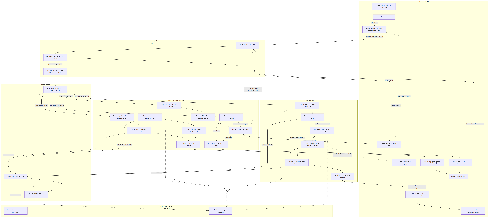

# 2. Architecture and Components

## System architecture


This exact-layout preview is generated from the same coordinates and routing as
the presentation-grade editable versions:
[`system-architecture.excalidraw`](diagrams/system-architecture.excalidraw) and
[`system-architecture.drawio`](diagrams/system-architecture.drawio).
The concise Mermaid source remains available as
[`system-architecture.mmd`](diagrams/system-architecture.mmd).

## DevUI prompt-to-answer flow

[](diagrams/devui-prompt-to-answer-flow.png)

Open the image above to inspect the high-resolution flow. Its editable text
source is
[`devui-prompt-to-answer-flow.mmd`](diagrams/devui-prompt-to-answer-flow.mmd).

The flow begins when an authenticated user enters a topic in DevUI and ends
when DevUI displays the research brief, written content, social content, and
podcast. DevUI browser JavaScript orchestrates the workflow; the agents do not
call each other directly.

### Execution sequence

| Step | Layer | Request or action | Result |
|---|---|---|---|
| 1 | DevUI | The user enters a topic and selects **Run**. | DevUI rejects an empty topic, disables the Run button, clears the previous output, and creates one workflow ID plus research, creator, and podcaster task IDs. |
| 2 | Browser to edge | DevUI sends `POST /api/agents/research/a2a` with an A2A JSON-RPC `tasks/send` request. | AGC routes `/api` to OAuth2 Proxy and the BFF. |
| 3 | Identity | OAuth2 Proxy validates the secure session cookie. | An unauthenticated request is redirected to Microsoft Entra ID; an authenticated request carries the user identity to the BFF. |
| 4 | BFF | The BFF requires the OAuth identity, preserves tracing headers, and adds the server-held A2A bearer token. | The browser never receives the reusable downstream agent credential. |
| 5 | APIM | The BFF calls the Foundry-governed research API in APIM. | APIM routes the call through the origin API to the research agent private AKS load balancer. |
| 6 | Research agent | The agent discovers and ranks sources. With sandbox mode enabled, it groups URLs by domain and requests isolated retrieval through the Sandbox Broker. | ACA Sandboxes fetch policy-allowed domains and return content plus egress evidence. |
| 7 | Live status | DevUI polls `/api/agents/research/status?task_id=...` every 1.5 seconds while research runs. | Real sandbox lifecycle and egress evidence appear before the brief is ready. |
| 8 | Research result | Research uses APIM `/openai` for inference and returns the brief as an A2A artifact. | The response returns through APIM, BFF, OAuth2 Proxy, and AGC; DevUI renders the brief and final sandbox evidence. |
| 9 | Browser fan-out | DevUI sends the same brief to Creator and Podcaster in parallel using separate A2A `tasks/send` requests. | Neither downstream agent calls Research or the other agent. |
| 10 | Creator branch | Creator uses the APIM model gateway and returns the blog and social package synchronously as an A2A artifact. | DevUI validates and displays the content package as soon as this branch completes. |
| 11 | Podcaster branch | Podcaster creates an internal task and returns HTTP `202` with a task ID. | Podcast generation continues while DevUI remains responsive. |
| 12 | Podcast processing | Podcaster generates the script, calls speech through APIM, assembles audio, and uploads it through the private Blob endpoint. | Successful completion requires private Blob persistence. |
| 13 | Podcast polling | DevUI calls `/api/agents/podcaster/tasks/<task-id>` every three seconds for at most 200 attempts. | Progress is shown until `completed`, `failed`, or the approximately ten-minute limit is reached. |
| 14 | Final answer | DevUI renders the playable audio and transcript and re-enables **Run** after both generation branches have been awaited. | One workflow shows research evidence, the brief, blog, social posts, podcast audio, and transcript. |

### Execution behavior

- The browser, not an agent, controls execution order.
- Research must complete before Creator and Podcaster start.
- Creator and Podcaster run concurrently. Creator is synchronous; Podcaster is
  asynchronous and polled.
- Browser-to-agent calls follow
  `DevUI -> AGC -> OAuth2 Proxy -> BFF -> APIM -> private agent origin`.
- Model and speech calls follow
  `agent -> APIM /openai -> Microsoft Foundry`.
- A Research failure stops fan-out. A Creator failure does not stop a podcast
  already in progress. A Podcaster failure does not remove completed content.
- Trace context allows the gateway, agents, model, sandbox, and storage work to
  be correlated in Application Insights.

## Architecture layers

### 1. Edge and identity

Application Gateway for Containers (AGC) is the public application entry point.
It terminates TLS and routes static requests to DevUI and protected API requests
to the oauth2-proxy sidecar. OAuth2 Proxy completes the Microsoft Entra ID flow
and passes trusted identity headers to the loopback-only BFF.

The browser receives no model, A2A, Storage, or Sandbox credentials.

#### Identity deep dive

See [Identity and access deep dive](11-identity-and-access-deep-dive.md) for
the Entra user flow, OAuth application, AKS workload federation, managed
identity and RBAC matrix, platform identities, internal service credentials,
and least-privilege review.

DevUI is not a server-side orchestrator. NGINX returns the static HTML and
JavaScript to the browser. That JavaScript creates workflow task IDs, calls the
same-origin `/api/agents/*` routes, receives the research brief, and then sends
that brief to creator and podcaster in parallel. Every one of those calls
traverses AGC, oauth2-proxy, and the BFF.

There is intentionally no pod-to-pod DevUI-to-BFF connection. The connection is
made by browser JavaScript:

```text
Browser -- GET / ----------------------> AGC --> DevUI NGINX
Browser -- /api/* with session cookie -> AGC --> OAuth2 Proxy --> BFF
Browser <--------- OIDC redirect -------------------------- OAuth2 Proxy
Browser <--------> Microsoft Entra ID
Browser -- /oauth2/callback ------------> AGC --> OAuth2 Proxy
```

### 2. Browser security boundary

DevUI is static NGINX content. The FastAPI BFF is the authenticated browser
boundary. It reads the trusted identity, normalizes downstream errors, and sends
server-side A2A requests to APIM. It does not call AKS agents directly.

### 3. AI governance

APIM Standard v2 provides two distinct runtime surfaces:

- Stable HTTPS A2A endpoints for the BFF and Foundry callers.
- A governed `/openai` model API used by all three agents.
- Token and request throttling.
- Diagnostics and correlation.
- Outbound VNet integration to private AKS origins.

#### APIM deep dive

See [APIM AI Gateway deep dive](10-apim-ai-gateway-deep-dive.md) for the API
inventory, the Foundry-generated-to-origin routing chain, authentication
boundaries, model policies, token governance, and diagnostics.

Microsoft Foundry also has two distinct roles:

- **Runtime model host:** APIM authenticates to the Foundry model endpoint with
  managed identity after applying token policy and telemetry.
- **Custom-agent registry:** Foundry stores each agent's APIM-governed URL and
  agent card. Foundry can discover or invoke the agent through APIM, but the
  registry is not in the DevUI workflow's data path.

### 4. Agent runtime


Each agent uses a distinct framework and runtime pairing while exposing the
same A2A interoperability surface.

| Component | Runtime | Responsibility | Port |
|---|---|---|---:|
| Research agent | Python, FastAPI, LangGraph | Discover, rank, fetch, and synthesize sources | 8001 |
| Creator agent | .NET 10, ASP.NET, Microsoft Agent Framework | Generate blog and social content | 8002 |
| Podcaster agent | Python, FastAPI, GitHub Copilot SDK | Generate script and audio | 8003 |
| Sandbox broker | Python, FastAPI | Own ACA Sandbox permissions and lifecycle | 8010 |
| BFF | Python, FastAPI | Authenticated browser API and A2A proxy | 8081 |
| DevUI | NGINX and static HTML | Workflow UI and status visualization | 8080 |
| OTEL Collector | OpenTelemetry Collector | Buffer and export application telemetry | 4317 |

Each Azure-integrated workload uses a dedicated Kubernetes service account,
managed identity, and federated credential.

### 5. Sandbox execution

The research agent groups selected URLs by domain and caps each workflow at five
sandboxes. The broker creates them in parallel, applies a default-deny egress
policy, executes retrieval, collects runtime egress decisions, and schedules
asynchronous deletion after the configured retention interval.

The broker is the only workload granted Sandbox Group data-plane permissions.
The research agent authenticates to the broker with a scoped token and cannot
create sandboxes directly.

### 6. Data and telemetry

The podcaster uses Workload Identity to persist audio through a private Blob
endpoint. Browser playback uses the successful generation result while the
private blob remains the persistence record.

Research, creator, podcaster, BFF, and broker send OTLP to the in-cluster
collector. APIM and Azure platform resources send diagnostics to Application
Insights and Log Analytics.

## Agent pipelines

### Research

```text
plan -> search -> rank -> sandbox fetch -> extract links -> synthesize brief
```

The agent searches Microsoft Learn, GitHub, Azure blogs, Tech Community, and
Azure Updates. It ranks sources, fetches selected content in ACA Sandboxes, and
returns a structured brief through A2A.

### Creator

```text
validate brief -> generate blog -> generate social content -> package output
```

Microsoft Agent Framework executors own role-specific agents and sessions.
Template output is used only where explicitly defined by the agent; transport
or model failures must remain visible to the caller.

### Podcaster

```text
enrich sources -> generate and critique script -> synthesize -> assemble -> upload
```

The podcaster uses the GitHub Copilot SDK in BYOK mode, performs multi-turn
script generation, synthesizes two voices, and requires Blob persistence to
succeed before reporting completion.

## A2A surface

| Agent | Required routes |
|---|---|
| Research | `/health`, `/status`, `/a2a`, `/.well-known/agent-card.json` |
| Creator | `/health`, `/a2a`, `/.well-known/agent-card.json` |
| Podcaster | `/health`, `/a2a`, `/tasks/:id`, `/.well-known/agent-card.json` |

APIM provides a root POST compatibility operation that rewrites to `/a2a`
because Foundry-generated cards advertise the governed base URL.

## A2A interaction model

The agents do not call each other directly.

```text
DevUI browser
  -> BFF -> APIM -> Research
  <- research brief
  -> BFF -> APIM -> Creator      (brief payload)
  -> BFF -> APIM -> Podcaster    (same brief payload, parallel)
```

Creator returns synchronously. Podcaster returns a task ID and DevUI polls its
APIM-governed task endpoint through the BFF. Research independently calls the
private sandbox broker; that broker relationship is not A2A orchestration.

## Key decisions

- AKS is the agent runtime; ACA Sandboxes are external isolated execution.
- APIM is the only governed agent and model gateway.
- The BFF prevents reusable downstream credentials from entering the browser.
- Private load balancers provide stable, non-public agent origins.
- `loadBalancerSourceRanges` restricts those origins to the APIM subnet, while
  `externalTrafficPolicy: Local` preserves the APIM source address so Cilium
  NetworkPolicy can independently enforce the same source restriction.
- KARS is deferred until the conventional AKS baseline has measurable behavior.

The Helm template applies these fields to every private agent Service when
`privateAgentOrigins.enabled=true`:

```yaml
spec:
  type: LoadBalancer
  externalTrafficPolicy: Local
  loadBalancerSourceRanges:
    - 10.40.18.0/24
```

See [`templates/agents.yaml`](../deploy/helm/content-factory/templates/agents.yaml)
for the Service template and
[`values.example.yaml`](../deploy/helm/content-factory/values.example.yaml) for
the APIM source CIDR.
