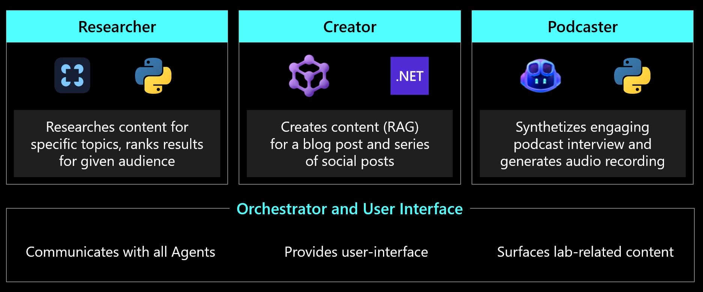

# 2. Architecture and Components

## System architecture


This exact-layout preview is generated from the same coordinates and routing as
the presentation-grade editable versions:
[`system-architecture.excalidraw`](diagrams/system-architecture.excalidraw) and
[`system-architecture.drawio`](diagrams/system-architecture.drawio).
The concise Mermaid source remains available as
[`system-architecture.mmd`](diagrams/system-architecture.mmd).

## Layer-by-layer execution

### 1. Edge and identity

Application Gateway for Containers (AGC) is the public application entry point.
It terminates TLS and routes static requests to DevUI and protected API requests
to the oauth2-proxy sidecar. OAuth2 Proxy completes the Microsoft Entra ID flow
and passes trusted identity headers to the loopback-only BFF.

The browser receives no model, A2A, Storage, or Sandbox credentials.

DevUI is not a server-side orchestrator. NGINX returns the static HTML and
JavaScript to the browser. That JavaScript creates workflow task IDs, calls the
same-origin `/api/agents/*` routes, receives the research brief, and then sends
that brief to creator and podcaster in parallel. Every one of those calls
traverses AGC, oauth2-proxy, and the BFF.

There is intentionally no pod-to-pod DevUI-to-BFF connection. The connection is
made by browser JavaScript:

```text
Browser -- GET / ----------------------> AGC --> DevUI NGINX
Browser -- /api/* with session cookie -> AGC --> OAuth2 Proxy --> BFF
Browser <--------- OIDC redirect -------------------------- OAuth2 Proxy
Browser <--------> Microsoft Entra ID
Browser -- /oauth2/callback ------------> AGC --> OAuth2 Proxy
```

### 2. Browser security boundary

DevUI is static NGINX content. The FastAPI BFF is the authenticated browser
boundary. It reads the trusted identity, normalizes downstream errors, and sends
server-side A2A requests to APIM. It does not call AKS agents directly.

### 3. AI governance

APIM Standard v2 provides two distinct runtime surfaces:

- Stable HTTPS A2A endpoints for the BFF and Foundry callers.
- A governed `/openai` model API used by all three agents.
- Token and request throttling.
- Diagnostics and correlation.
- Outbound VNet integration to private AKS origins.

Microsoft Foundry also has two distinct roles:

- **Runtime model host:** APIM authenticates to the Foundry model endpoint with
  managed identity after applying token policy and telemetry.
- **Custom-agent registry:** Foundry stores each agent's APIM-governed URL and
  agent card. Foundry can discover or invoke the agent through APIM, but the
  registry is not in the DevUI workflow's data path.

### 4. Agent runtime



Each agent uses a distinct framework and runtime pairing while exposing the
same A2A interoperability surface.

| Component | Runtime | Responsibility | Port |
|---|---|---|---:|
| Research agent | Python, FastAPI, LangGraph | Discover, rank, fetch, and synthesize sources | 8001 |
| Creator agent | .NET 10, ASP.NET, Microsoft Agent Framework | Generate blog and social content | 8002 |
| Podcaster agent | Python, FastAPI, GitHub Copilot SDK | Generate script and audio | 8003 |
| Sandbox broker | Python, FastAPI | Own ACA Sandbox permissions and lifecycle | 8010 |
| BFF | Python, FastAPI | Authenticated browser API and A2A proxy | 8081 |
| DevUI | NGINX and static HTML | Workflow UI and status visualization | 8080 |
| OTEL Collector | OpenTelemetry Collector | Buffer and export application telemetry | 4317 |

Each Azure-integrated workload uses a dedicated Kubernetes service account,
managed identity, and federated credential.

### 5. Sandbox execution

The research agent groups selected URLs by domain and caps each workflow at five
sandboxes. The broker creates them in parallel, applies a default-deny egress
policy, executes retrieval, collects runtime egress decisions, and schedules
asynchronous deletion after the configured retention interval.

The broker is the only workload granted Sandbox Group data-plane permissions.
The research agent authenticates to the broker with a scoped token and cannot
create sandboxes directly.

### 6. Data and telemetry

The podcaster uses Workload Identity to persist audio through a private Blob
endpoint. Browser playback uses the successful generation result while the
private blob remains the persistence record.

Research, creator, podcaster, BFF, and broker send OTLP to the in-cluster
collector. APIM and Azure platform resources send diagnostics to Application
Insights and Log Analytics.

## Agent pipelines

### Research

```text
plan -> search -> rank -> sandbox fetch -> extract links -> synthesize brief
```

The agent searches Microsoft Learn, GitHub, Azure blogs, Tech Community, and
Azure Updates. It ranks sources, fetches selected content in ACA Sandboxes, and
returns a structured brief through A2A.

### Creator

```text
validate brief -> generate blog -> generate social content -> package output
```

Microsoft Agent Framework executors own role-specific agents and sessions.
Template output is used only where explicitly defined by the agent; transport
or model failures must remain visible to the caller.

### Podcaster

```text
enrich sources -> generate and critique script -> synthesize -> assemble -> upload
```

The podcaster uses the GitHub Copilot SDK in BYOK mode, performs multi-turn
script generation, synthesizes two voices, and requires Blob persistence to
succeed before reporting completion.

## A2A surface

| Agent | Required routes |
|---|---|
| Research | `/health`, `/status`, `/a2a`, `/.well-known/agent-card.json` |
| Creator | `/health`, `/a2a`, `/.well-known/agent-card.json` |
| Podcaster | `/health`, `/a2a`, `/tasks/:id`, `/.well-known/agent-card.json` |

APIM provides a root POST compatibility operation that rewrites to `/a2a`
because Foundry-generated cards advertise the governed base URL.

## Agent interaction model



The agents do not call each other directly.

```text
DevUI browser
  -> BFF -> APIM -> Research
  <- research brief
  -> BFF -> APIM -> Creator      (brief payload)
  -> BFF -> APIM -> Podcaster    (same brief payload, parallel)
```

Creator returns synchronously. Podcaster returns a task ID and DevUI polls its
APIM-governed task endpoint through the BFF. Research independently calls the
private sandbox broker; that broker relationship is not A2A orchestration.

## Key decisions

- AKS is the agent runtime; ACA Sandboxes are external isolated execution.
- APIM is the only governed agent and model gateway.
- The BFF prevents reusable downstream credentials from entering the browser.
- Private load balancers provide stable, non-public agent origins.
- `loadBalancerSourceRanges` restricts those origins to the APIM subnet, while
  `externalTrafficPolicy: Local` preserves the APIM source address so Cilium
  NetworkPolicy can independently enforce the same source restriction.
- KARS is deferred until the conventional AKS baseline has measurable behavior.

The Helm template applies these fields to every private agent Service when
`privateAgentOrigins.enabled=true`:

```yaml
spec:
  type: LoadBalancer
  externalTrafficPolicy: Local
  loadBalancerSourceRanges:
    - 10.40.18.0/24
```

See [`templates/agents.yaml`](../deploy/helm/content-factory/templates/agents.yaml)
for the Service template and
[`values.example.yaml`](../deploy/helm/content-factory/values.example.yaml) for
the APIM source CIDR.
