# 3. Network Design and Security Flow

## Network topology

The editable Mermaid source is
[`network-design.mmd`](diagrams/network-design.mmd).

## Address plan

| Network | CIDR or address | Purpose |
|---|---|---|
| Lab VNet | `10.40.0.0/16` | Shared network boundary |
| AKS subnet | `10.40.0.0/20` | Nodes, pods, and internal load balancers |
| AGC subnet | `10.40.16.0/24` | AGC association and data plane |
| Private endpoint subnet | `10.40.17.0/24` | Storage private endpoint |
| APIM subnet | `10.40.18.0/24` | APIM Standard v2 outbound integration |
| Research origin | `10.40.15.240:8001` | APIM-only internal load balancer |
| Creator origin | `10.40.15.241:8002` | APIM-only internal load balancer |
| Podcaster origin | `10.40.15.242:8003` | APIM-only internal load balancer |
| Blob private endpoint | `10.40.17.4:443` | Podcaster persistence |

These are the default lab addresses from [`infra/main.bicep`](../infra/main.bicep).
Change them together in Bicep and Helm values if the target network overlaps.

## Inbound flow

1. Internet clients reach only AGC on HTTPS.
2. AGC routes `/` to DevUI.
3. AGC routes `/api` and `/oauth2` to the BFF Service, whose target is
   oauth2-proxy when Entra authentication is enabled.
4. OAuth2 Proxy forwards authenticated requests to the loopback BFF container.
5. No agent Service is internet-facing.

The current lab listener uses a self-signed certificate. Production requires a
custom DNS name and trusted Kubernetes TLS secret or a trusted frontend service.

## Governed A2A flow

1. BFF calls APIM over HTTPS.
2. APIM uses outbound VNet integration from `10.40.18.0/24`.
3. Each agent has a fixed internal load balancer address.
4. `externalTrafficPolicy: Local` preserves the APIM source.
5. Cilium NetworkPolicy allows the agent port only from the APIM subnet.
6. A shared A2A bearer token remains a compatibility control until Entra-based
   origin authentication is implemented end to end.

## Sandbox flow

The research agent cannot access ACA Sandbox control APIs. It calls the broker
on port 8010. The broker uses Workload Identity and the Sandbox Group data owner
role to create and manage individual sandboxes.

Each sandbox receives:

- `default_action=Deny`
- Allow rules for its assigned source domains
- Package endpoints required by the execution image
- Full traffic inspection

An intentional Bing request demonstrates default-deny behavior. Bing is absent
from the configured rule list because it is implicitly denied, not because an
explicit Bing deny rule exists.

## Storage flow

Storage public network access is disabled. The podcaster resolves the Blob
endpoint through private DNS and may connect only to `10.40.17.4/32` on HTTPS.
Its managed identity has Storage Blob Data Contributor.

## Telemetry flow

Application workloads send OTLP/gRPC to the in-cluster collector on port 4317.
The collector exports to Application Insights. APIM also writes request and
dependency telemetry to the same component. Azure platform logs are stored in
Log Analytics.

Telemetry must not capture authorization headers, cookies, model credentials,
prompts, generated customer content, or sandbox tokens by default.

## Network policy model

- Namespace ingress and egress are denied by default.
- DNS is explicitly allowed.
- BFF may reach APIM over HTTPS.
- APIM may reach only the three private agent origins.
- Research may reach the broker.
- Broker may reach ACA Sandbox endpoints over HTTPS.
- Podcaster may reach the Blob private endpoint.
- Instrumented workloads may reach the OTEL Collector.
- Internet egress is granted only where a workload requires it.

Validate the implemented policies in
[`deploy/helm/content-factory/templates/networkpolicies.yaml`](../deploy/helm/content-factory/templates/networkpolicies.yaml).

