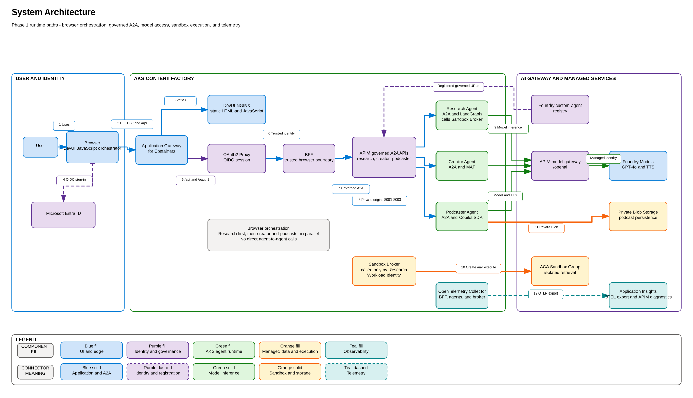

# 5. Manual Configuration and Verification

This document separates steps that still require an operator from verification
of Foundry connections already created by Bicep. Complete it after
[Deployment](04-deployment.md).



## Automation boundary

The deployment implementation was checked against
[`infra/main.bicep`](../infra/main.bicep) and the Helm chart:

| Area | Current implementation | Operator action |
|---|---|---|
| Entra application registration | Created or adopted by `deploy/configure-entra.ps1` | Verify the selected app; no manual secret creation |
| Trusted DevUI certificate | Helm references an existing TLS Secret | Supply trusted DNS and certificate material |
| Foundry APIM project connection | Created by Bicep as `apimProjectConnection` | Verify the connected resource and AI Gateway status |
| Foundry Application Insights connection | Created by Bicep as `appInsightsProjectConnection` | Verify the connection and Monitoring Reader assignment |
| Foundry custom A2A assets | Not created by Bicep | Register the three governed agent URLs |
| Kubernetes runtime Secret | Base Secret is operator-managed; OAuth keys are patched by the Entra script | Supply the non-Entra values or synchronize them from Key Vault |

## 1. Verify the automated Entra application

[`deploy/deploy-workloads.ps1`](../deploy/deploy-workloads.ps1) calls
[`deploy/configure-entra.ps1`](../deploy/configure-entra.ps1) before Helm. The
script:

1. Reuses an explicitly supplied application ID, the runtime Secret annotation,
   the currently deployed OAuth2 Proxy client ID, or one uniquely matching the
   configured display name, in that order.
2. Creates a single-tenant application when none can be adopted.
3. Adds `https://<devui-hostname>/oauth2/callback` without removing existing
   redirect URIs.
4. Ensures the corresponding service principal exists.
5. Creates a one-year client credential only when the Kubernetes Secret has no
   matching credential, or when rotation is explicitly requested.
6. Generates the OAuth cookie secret when absent.
7. Patches both OAuth values into the existing Kubernetes Secret without
   writing them to the Helm values file or console.

The signed-in deployment identity must be allowed to create application
registrations. If tenant policy blocks app creation, an owner of an existing
registration can pass its client ID with `-EntraApplicationId`.

Verify that the application uses the expected callback and that the client ID
shown in the OAuth2 Proxy deployment matches the Secret annotation:

```powershell
kubectl -n content-factory get secret content-factory-secrets `
  -o jsonpath='{.metadata.annotations.content-factory\.azure\.com/entra-client-id}'
```

Rerun the workload deployment with `-RotateEntraClientSecret` before the
credential expires. The generated secret remains confidential and is never
committed.

## 2. Trusted DevUI TLS

AGC provides a frontend FQDN but does not issue a trusted managed certificate.
The current lab uses a self-signed Kubernetes TLS Secret.

For a trusted endpoint:

1. Choose a custom DNS name.
2. Point its record to the AGC frontend.
3. Obtain a certificate covering that name.
4. Create or synchronize the Kubernetes TLS Secret.
5. Set `gateway.hostname` and `gateway.certificateSecretName`.
6. Rerun the workload deployment with the final `-GatewayHostname`; the Entra
   script adds its callback URI automatically.

Azure Front Door in front of AGC is an alternative trusted public frontend.

## 3. Verify the Bicep-managed APIM project connection

The Bicep resource `apimProjectConnection` creates an `ApiManagement`
connection under the Foundry project, targets the deployed APIM instance, and
records its gateway URL. Do not add a duplicate connection.

After deployment, verify in Foundry:

1. Open the Foundry resource and project.
2. Select **Manage > Connected resources** and confirm the APIM connection
   targets the Bicep-deployed instance.
3. Open **Manage > AI Gateway** and confirm the project uses that APIM gateway.
4. Confirm the displayed gateway URL matches
   `https://<apim-name>.azure-api.net`.

If the portal does not recognize the Bicep-managed connection as the active AI
Gateway, use **Add AI Gateway > Use existing APIM**, select the same APIM
instance, and then reconcile the resulting connection name with Bicep. Do not
create a second APIM service.

## 4. Verify the Bicep-managed Application Insights connection

The Bicep resource `appInsightsProjectConnection` creates the project connection
with `ProjectManagedIdentity`. Bicep also assigns Monitoring Reader to the
Foundry project identity unless an existing assignment name is supplied.

In the Foundry project:

1. Open **Manage > Project details > Connected resources**.
2. Confirm the deployed Application Insights component is present.
3. Confirm authentication is **Project managed identity**.
4. Confirm the project identity has Monitoring Reader on Application Insights.

If an existing portal-created connection predates the template, pass its
resource name as `appInsightsProjectConnectionName` so Bicep adopts that
connection rather than creating another one.

## 5. Register the three Foundry assets

Register each agent under **Operate > Assets** with source **Custom** and
protocol **A2A**.

| Asset | Agent URL | Agent card |
|---|---|---|
| `research-agent` | `https://<apim-host>/research-agent` | `https://<apim-host>/research-agent/.well-known/agent-card.json` |
| `creator-agent` | `https://<apim-host>/creator-agent` | `https://<apim-host>/creator-agent/.well-known/agent-card.json` |
| `podcaster-agent` | `https://<apim-host>/podcaster-agent` | `https://<apim-host>/podcaster-agent/.well-known/agent-card.json` |

Use the stable governed base URL, not the private origin and not a URL ending in
`/a2a`. Enter the matching OTEL service name for each asset.

Asset registration is currently an authenticated Foundry control-plane action
and is intentionally documented rather than represented as a fake deployment
success.

## 6. Runtime secrets

The Helm chart references an existing Secret. The lab secret requires:

- A2A authentication token
- Sandbox broker token
- Any temporary model compatibility credential still required by the selected
  APIM policy

The Entra automation adds the OAuth client and cookie values to the same Secret.
Production should synchronize these from Key Vault through the CSI driver.

## 7. Post-configuration checks

- Sign in to DevUI and confirm the real user appears in the account menu.
- Confirm APIM appears as the project AI Gateway.
- Confirm all three custom agents are active in Foundry.
- Confirm Foundry Application Analytics shows the shared Application Insights
  component.
- Invoke every agent through its APIM-governed URL.
- Replace the self-signed certificate before treating the endpoint as
  production-ready.
