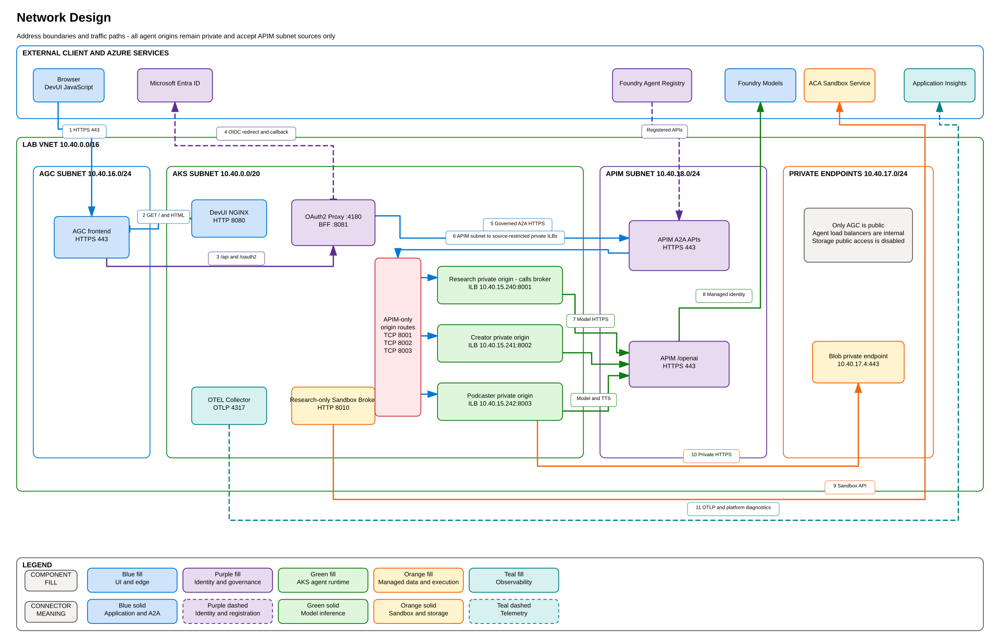

# 8. Current Lab Environment Reference

This page records the currently validated lab instance. Reusable deployment
instructions use placeholders in [Deployment](04-deployment.md).

Validated on September 21, 2026.

## Current network placement

The addresses below correspond directly to the subnet, private-origin, APIM,
private endpoint, and connector labels in the diagram.

## Azure resources

| Purpose | Current value |
|---|---|
| Region | `swedencentral` |
| Resource group | `aca-sandbox-content-factory-rg` |
| AKS | `aca-sandbox-aks` |
| Container registry | `acracasandboxcf` |
| APIM | `aca-sandbox-apim` |
| Foundry resource | `aca-sandbox-foundry` |
| Foundry project | `aca-sandbox-project` |
| Application Insights | `aca-sandbox-appinsights` |
| Log Analytics | `aca-sandbox-logs` |
| AGC | `aca-sandbox-agc` |
| Sandbox Group | `aca-sandbox-sandbox-group` |
| Kubernetes namespace | `content-factory` |

## Endpoints

| Endpoint | Current value |
|---|---|
| DevUI | `https://h0hbcahkd9dvh8ha.fz11.alb.azure.com` |
| APIM gateway | `https://aca-sandbox-apim.azure-api.net` |
| Foundry project | `https://aca-sandbox-foundry.services.ai.azure.com/api/projects/aca-sandbox-project` |

The DevUI endpoint currently uses a self-signed certificate.

## Private origins

| Agent | Address | Port | OTEL service |
|---|---:|---:|---|
| Research | `10.40.15.240` | 8001 | `research-agent` |
| Creator | `10.40.15.241` | 8002 | `creator-agent` |
| Podcaster | `10.40.15.242` | 8003 | `podcaster-agent` |

Only the APIM subnet `10.40.18.0/24` may reach these origins.

## Current workload images

| Workload | Image tag |
|---|---|
| Research | `20260921.2` |
| Creator | `20260920.2` |
| Podcaster | `20260921.4` |
| Sandbox broker | `20260921.5` |
| BFF | `20260921.2` |
| DevUI | `20260921.6` |

All application Deployments run one replica in the Phase 1 lab.

## Foundry assets

| Asset | Governed URL |
|---|---|
| `research-agent` | `https://aca-sandbox-apim.azure-api.net/research-agent` |
| `creator-agent` | `https://aca-sandbox-apim.azure-api.net/creator-agent` |
| `podcaster-agent` | `https://aca-sandbox-apim.azure-api.net/podcaster-agent` |

The project Application Insights connection is named
`acasandboxappinsights761fnf` and uses Project Managed Identity.

## Sandbox behavior

- Sandboxes are created on demand and grouped by source domain.
- Each workflow creates at most five sandboxes.
- The common 25-source run currently produces four groups.
- Completed sandboxes are retained for 60 seconds, then deleted.
- Bing is an intentional default-deny egress test.
- Four or five is not an Azure Sandbox Group platform limit.

The live Microsoft.App quota query reports 2,000 Sandbox Cores in Sweden
Central, but marks that quota as not applicable for this subscription. Do not
treat the published value as a guaranteed concurrent-sandbox count.

## Operational notes

- AKS uses a public API endpoint for lab convenience; local accounts remain
  disabled.
- Blob Storage public network access is disabled.
- The Blob private endpoint is `10.40.17.4`.
- GPT-4o and the APIM model policy are configured for 100,000 tokens per minute.
- APIM has a practical synchronous request ceiling near four minutes; long
  operations should use asynchronous task polling.
