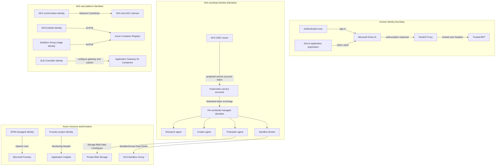

# 11. Identity and Access Deep Dive

The solution uses multiple identity systems for different trust boundaries.
Human authentication, Kubernetes workload identity, Azure managed identities,
Azure RBAC, APIM subscriptions, and internal service tokens are related but are
not interchangeable.

This guide identifies every major principal, explains how credentials are
obtained, and distinguishes active runtime permissions from identities that are
provisioned but not currently exercised.

## Identity model at a glance

<!-- mermaid-checked: no \n, no em-dash/en-dash, no {} in labels, subgraphs are id["label"], arrows are -->|"label"|, all subgraphs closed by end, ids unique -->


## Identity types and trust boundaries

| Identity type | Principal | Trust purpose |
|---|---|---|
| Human identity | Microsoft Entra user | Signs in to DevUI and administers Azure or AKS when separately authorized |
| OAuth client identity | DevUI Entra application and service principal | Represents OAuth2 Proxy during the OIDC authorization-code flow |
| Kubernetes identity | Service account subject such as `system:serviceaccount:content-factory:podcaster` | Identifies a pod workload to the AKS OIDC issuer |
| Workload managed identity | One user-assigned managed identity per AKS workload | Exchanges a projected service-account token for an Azure access token |
| Azure platform identity | System-assigned identities for AKS, APIM, Foundry, and the Foundry project | Allows Azure resources to call other Azure control or data planes |
| Add-on identity | Kubelet and ALB Controller managed identities | Pulls images and manages Application Gateway for Containers resources |
| Internal application credential | A2A token and Sandbox Broker token | Authenticates service-to-service calls that do not use Azure RBAC |
| APIM subscription credential | Model gateway subscription value | Authorizes agents to call the APIM `/openai` surface |

## 1. User sign-in and DevUI session

The DevUI authentication path is:

```text
Browser
  -> Application Gateway for Containers
  -> OAuth2 Proxy
  -> Microsoft Entra ID
  -> /oauth2/callback
  -> secure session cookie
  -> BFF
```

[`deploy/configure-entra.ps1`](../deploy/configure-entra.ps1) creates or adopts
a single-tenant application registration, adds the final
`https://<hostname>/oauth2/callback` redirect URI, ensures a service principal
exists, and creates a one-year client credential when required.

OAuth2 Proxy stores the client secret and its cookie-encryption secret in the
existing Kubernetes Secret. After sign-in, it forwards trusted identity headers
to the loopback BFF. The BFF reads `X-Auth-Request-User` or
`X-Forwarded-User`, and the corresponding email headers, and rejects protected
requests when neither identity value is present.

Important boundaries:

- The Entra user identity authenticates the person; it is not forwarded to an
  agent as an Azure token.
- The BFF trusts identity headers only because it is reached through its
  OAuth2 Proxy sidecar.
- The OAuth application service principal has no Azure resource RBAC role. Its
  purpose is OIDC sign-in, not data-plane access.
- The browser receives a session cookie but never receives the OAuth client
  secret, A2A token, APIM subscription value, or Azure workload token.

## 2. AKS workload identity federation

AKS has OIDC issuer and Workload Identity enabled. Local AKS accounts are
disabled, and Kubernetes authorization uses Microsoft Entra authentication plus
Azure RBAC.

Each workload follows the same federation chain:

1. Helm creates a Kubernetes service account annotated with the client ID of
   its user-assigned managed identity.
2. The pod carries `azure.workload.identity/use: "true"` and uses that service
   account.
3. The workload identity webhook projects a short-lived Kubernetes service
   account token and injects the Azure federation environment.
4. The token contains the AKS OIDC issuer, the audience
   `api://AzureADTokenExchange`, and a subject such as
   `system:serviceaccount:content-factory:podcaster`.
5. The matching Entra federated identity credential permits that exact subject
   to exchange the projected token for an Azure access token.
6. Azure RBAC on the destination resource determines what that managed identity
   may do.

No client secret is required for this exchange. The service-account token,
federated credential, managed identity, and RBAC assignment must all match.

## 3. Workload identity and RBAC matrix

| Workload | Kubernetes service account | Managed identity | Assigned Azure RBAC | Active runtime use |
|---|---|---|---|---|
| Research | `research` | `aca-sandbox-research-uami` | Cognitive Services OpenAI User on Foundry | Model calls currently use the APIM endpoint and APIM subscription value, so direct Foundry RBAC is not exercised. Research calls the broker with an internal token and has no Sandbox Group role. |
| Creator | `creator` | `aca-sandbox-creator-uami` | Cognitive Services OpenAI User on Foundry | Model calls currently use APIM with an API-key credential, so direct Foundry RBAC is not exercised. |
| Podcaster | `podcaster` | `aca-sandbox-podcaster-uami` | Cognitive Services OpenAI User on Foundry; Storage Blob Data Contributor on the Storage account | Blob Storage access actively uses Workload Identity through `DefaultAzureCredential`. Model and speech calls use APIM, so direct Foundry RBAC is not exercised. |
| BFF | `bff` | `aca-sandbox-bff-uami` | No Azure RBAC assignment | The BFF currently needs no Azure token. It uses the internal A2A token to call APIM-governed agents. |
| Sandbox Broker | `sandbox-broker` | `aca-sandbox-sandbox-broker-uami` | Container Apps SandboxGroup Data Owner on the Sandbox Group | Actively uses Workload Identity through `DefaultAzureCredential` to create, execute, inspect, and delete ACA Sandboxes. |

The Helm service-account annotations are defined in
[`templates/serviceaccounts.yaml`](../deploy/helm/content-factory/templates/serviceaccounts.yaml).
The federated credentials and RBAC assignments are defined in
[`infra/main.bicep`](../infra/main.bicep).

### Research-to-broker boundary

The deployed Research pod has `ACA_SANDBOX_BROKER_URL` configured, so it calls
the broker rather than using the direct Sandbox SDK path. The broker alone has
the Sandbox Group data-plane role. If the broker URL were removed, the code has
a direct SDK fallback, but that fallback would fail in the deployed environment
because the Research identity intentionally has no Sandbox Group permission.

This enforces the intended separation:

```text
Research identity
  -> internal broker token
  -> Sandbox Broker identity
  -> SandboxGroup Data Owner
  -> ACA Sandbox Group
```

## 4. APIM identity

APIM has a system-assigned managed identity. The Bicep deployment grants it
**Cognitive Services OpenAI User** on the Foundry resource.

When an agent calls APIM `/openai`:

1. The agent authenticates to APIM with the model API subscription value.
2. APIM applies the token-limit and metric policies.
3. APIM obtains a Microsoft Entra token for
   `https://cognitiveservices.azure.com`.
4. APIM replaces the backend `Authorization` header with that managed-identity
   token.
5. Foundry authorizes the APIM principal through Azure RBAC.

The agent therefore needs no Foundry credential in its container. See
[APIM AI Gateway deep dive](10-apim-ai-gateway-deep-dive.md) for the complete
gateway policy and API model.

The live environment also has a broader **Cognitive Services User** assignment
for APIM that is not created by the current Bicep template. The governed model
path is defined around **Cognitive Services OpenAI User**; the broader live
assignment should be reconciled and removed if no external dependency requires
it.

## 5. Foundry identities

Both the Foundry account and the Foundry project have system-assigned managed
identities.

The project connection to Application Insights uses
`ProjectManagedIdentity`. Bicep grants the project identity **Monitoring
Reader** on the Application Insights component so Foundry can read application
analytics without an instrumentation secret.

The live project identity also has **Monitoring Metrics Publisher** on
Application Insights and **Foundry User** on the parent Foundry resource. Those
assignments are platform or portal-managed and are not both declared by the
current Bicep template. Treat them as environment state that should be
reconciled before assuming a clean redeployment reproduces every portal
capability.

The Foundry account identity is enabled by the resource but has no
solution-specific RBAC assignment in the current template.

## 6. AKS and platform identities

| Principal | Role and scope | Purpose |
|---|---|---|
| AKS control-plane system identity | Network Contributor on the AKS subnet | Manages cluster networking resources in the delegated subnet |
| AKS control-plane system identity | Contributor on the AKS managed resource group | Platform-managed cluster infrastructure operations |
| Deployment operator | Azure Kubernetes Service RBAC Cluster Admin on the AKS resource | Administers Kubernetes through Entra and Azure RBAC; local cluster accounts remain disabled |
| AKS kubelet identity | AcrPull on the lab ACR | Pulls workload images for AKS pods |
| ALB Controller identity | AppGw for Containers Configuration Manager on the resource group | Programs AGC resources from Kubernetes Gateway API objects |
| ALB Controller identity | Network Contributor on the AGC subnet | Manages AGC network integration |
| Sandbox Group user-assigned identity | AcrPull on the lab ACR | Lets the Sandbox Group pull the configured execution image |

The AKS kubelet and ALB Controller identities are created or managed by the AKS
platform. [`infra/deploy.ps1`](../infra/deploy.ps1) attaches ACR and grants the
ALB Controller roles after the Bicep deployment.

## 7. Credentials that are not managed identities

| Credential | Stored or supplied by | Used for |
|---|---|---|
| OAuth client secret | Kubernetes runtime Secret | OAuth2 Proxy authenticates as the DevUI Entra application |
| OAuth cookie secret | Kubernetes runtime Secret | Encrypts and signs the OAuth2 Proxy session cookie |
| A2A authentication token | Kubernetes runtime Secret | BFF authenticates to each agent through APIM |
| Sandbox Broker token | Kubernetes runtime Secret | Research authenticates to the private broker API |
| APIM model subscription value | Kubernetes runtime Secret under the compatibility key `model-api-key` | Agents authenticate to the APIM `/openai` API |
| TLS private key | Kubernetes TLS Secret | AGC terminates HTTPS for the DevUI hostname |

These values authenticate application protocols; Azure RBAC cannot replace all
of them directly. Production should synchronize secret material from Key Vault
through the Secrets Store CSI Driver rather than maintaining long-lived values
manually in Kubernetes.

The `AZURE_OPENAI_API_KEY` environment variable contains the APIM model
subscription value in the deployed architecture, not a direct Foundry key. The
name remains for SDK compatibility.

## 8. Deployment identity

The human or automation identity running deployment is separate from every
runtime identity. It needs:

- Resource deployment permissions such as Contributor at the deployment scope.
- Permission to create role assignments, normally User Access Administrator or
  Owner at the required scopes.
- Permission under tenant policy to create or own the Entra application
  registration, unless an existing application ID is supplied.
- Permission to receive AKS administrator access when the template assigns the
  Azure Kubernetes Service RBAC Cluster Admin role.

These are deployment-time privileges and should not be granted to application
pods.

## 9. Least-privilege review

The current architecture has strong separation, but several assignments should
be reviewed:

1. **Research and Creator direct Foundry roles:** Their model clients use APIM
   subscription authentication, so direct Cognitive Services OpenAI User roles
   are not required by the current governed path.
2. **Podcaster direct Foundry role:** Storage RBAC is required; direct Foundry
   RBAC is not used by the current APIM model and speech path.
3. **BFF managed identity:** It has no RBAC and does not request Azure tokens.
   Keep it only if a planned Azure dependency requires it; otherwise remove its
   identity and federation to reduce unused principals.
4. **APIM live role drift:** The extra Cognitive Services User assignment is
   broader than the Bicep-declared OpenAI User assignment and should be
   reconciled.
5. **Foundry project role drift:** Portal-managed roles should be explicitly
   understood before claiming the Bicep template reproduces them.
6. **Secret-backed protocols:** Move OAuth, A2A, broker, and APIM subscription
   values to Key Vault CSI for production and establish rotation procedures.

Removing a role should follow a runtime regression test of the exact governed
path. Do not remove a principal merely because its role was not observed in one
request trace.

## Source of truth

- Azure identities, federation, and Bicep-managed role assignments:
  [`infra/main.bicep`](../infra/main.bicep)
- Deployment-time ACR and ALB Controller role assignments:
  [`infra/deploy.ps1`](../infra/deploy.ps1)
- Kubernetes service-account bindings:
  [`templates/serviceaccounts.yaml`](../deploy/helm/content-factory/templates/serviceaccounts.yaml)
- Pod identity selection and runtime environment:
  [`templates/agents.yaml`](../deploy/helm/content-factory/templates/agents.yaml)
  and
  [`templates/platform.yaml`](../deploy/helm/content-factory/templates/platform.yaml)
- Automated OAuth application lifecycle:
  [`deploy/configure-entra.ps1`](../deploy/configure-entra.ps1)
