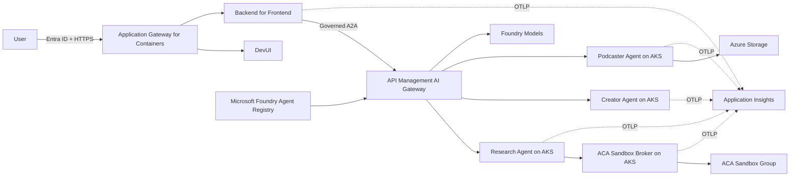

# Agentic Content Factory on AKS

This repository implements a three-agent content factory on Azure Kubernetes Service:

1. A Python/LangGraph research agent discovers and retrieves source material.
2. A .NET/Microsoft Agent Framework creator agent produces blog and social content.
3. A Python/GitHub Copilot SDK podcaster agent creates a script and audio.

Azure Container Apps Sandboxes remain part of the solution as isolated, policy-controlled execution environments. They are invoked through a private broker running on AKS rather than hosting the agents themselves.

The active implementation is [Option 2](Option2/). Option 1 remains in the repository as a legacy reference and is outside the current implementation scope.

## Architecture



### Platform decisions

- **AKS:** private cluster, Azure CNI powered by Cilium, OIDC, workload identity, dedicated agent node pool, and default-deny network policy.
- **Application Gateway for Containers:** public TLS/WAF ingress for DevUI and its BFF.
- **Backend for Frontend:** keeps agent credentials and downstream calls outside browser JavaScript.
- **APIM AI Gateway:** governs A2A and model calls with identity, policy, throttling, and telemetry.
- **Microsoft Foundry:** provides model deployments and custom-agent registration.
- **ACA Sandbox broker:** owns ACA Sandbox permissions and exposes only approved operations to the research agent.
- **Observability:** applications send OTLP through an OpenTelemetry Collector to Application Insights; Azure Monitor and managed Prometheus collect platform metrics and logs.
- **KARS:** deliberately deferred to Phase 2; the Phase 1 AKS baseline follows its current networking, identity, node-pool, and policy assumptions.

## Documentation

Start with the [Option 2 overview](Option2/readme.md), then read:

1. [Architecture](Option2/docs/01-architecture.md)
2. [Components](Option2/docs/02-components.md)
3. [Implementation](Option2/docs/03-implementation.md)
4. [Installation and deployment](Option2/docs/04-installation.md)
5. [Validation and operations](Option2/docs/05-validation-and-operations.md)
6. [Phase 2: KARS considerations](Option2/docs/06-kars-phase2.md)

## Implementation status

Phase 1 deployment artifacts are being implemented under:

- `Option2/infra/aks` for Azure infrastructure.
- `Option2/deploy/helm/content-factory` for AKS workloads.
- `Option2/Lab/src` for the existing agents and compatibility services.

The original Option 2 ACA template remains available during migration and must not be treated as the active AKS template.

## Validate the deployment assets

```powershell
.\Option2\deploy\validate.ps1 -SkipTests
```

For full installation instructions, including prerequisites, image builds, Helm deployment, APIM configuration, and Foundry registration, see [Installation and deployment](Option2/docs/04-installation.md).
