# Agentic Content Factory Lab

This repository contains a deployable multi-agent content factory on Azure
Kubernetes Service (AKS). Three A2A agents research a topic, create written
content, and produce a podcast. Azure API Management governs agent and model
traffic, Microsoft Foundry registers the agents, and Azure Container Apps
Sandboxes isolate web retrieval.

## Solution at a glance



1. Users authenticate with Microsoft Entra ID through Application Gateway for
   Containers.
2. DevUI calls the authenticated backend for frontend (BFF).
3. The BFF sends A2A requests through APIM AI Gateway.
4. APIM reaches three private AKS agent origins and the Foundry model endpoint.
5. The research agent asks the private sandbox broker to create policy-controlled
   ACA Sandboxes.
6. The podcaster stores generated audio in private Blob Storage.
7. Workloads export OTLP telemetry to Application Insights through an in-cluster
   OpenTelemetry Collector.

## Repository layout

```text
.
|-- src/                    # Agents, BFF, DevUI, broker, optional TTS server
|-- infra/                  # Active AKS and Azure infrastructure Bicep
|-- deploy/                 # Helm chart and deployment validation scripts
|-- docs/                   # Ordered architecture and operations guidance
|-- sample-output/          # Example generated output
|-- docker-compose.yml      # Local integrated environment
|-- azure.yaml              # Azure Developer CLI infrastructure entry point
`-- .azure/                 # Local deployment plan, ignored by Git
```

## Documentation

Read the documentation in this order:

1. [Solution overview](docs/01-overview.md)
2. [Architecture and components](docs/02-architecture.md)
3. [Network design and security flow](docs/03-network-design.md)
4. [Deployment](docs/04-deployment.md)
5. [Manual configuration](docs/05-manual-configuration.md)
6. [Validation and operations](docs/06-validation-and-operations.md)
7. [Local development](docs/07-local-development.md)
8. [Current lab environment](docs/08-environment-reference.md)
9. [KARS Phase 2 considerations](docs/09-kars-phase2.md)

Architecture sources and exports are under
[`docs/diagrams/`](docs/diagrams/README.md).

## Quick validation

```powershell
.\deploy\validate.ps1 -SkipTests
```

To run all application tests as well:

```powershell
.\deploy\validate.ps1
```

## Deployment boundary

Phase 1 is deployed and validated on AKS. KARS is intentionally excluded from
Phase 1 and remains a separately gated Phase 2 decision. The demonstration AKS
API endpoint is public for operator convenience, but workloads are private.
Production deployments must use a private AKS control plane and trusted TLS.
